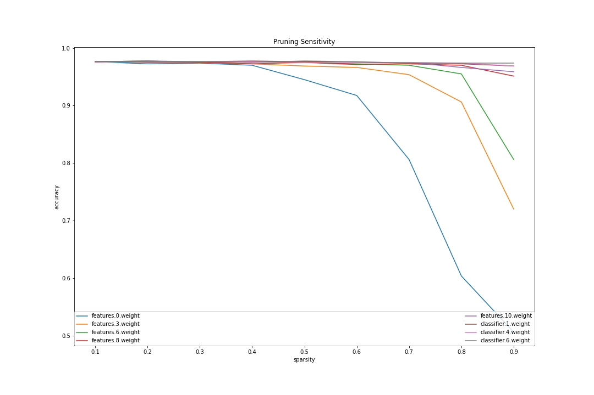

# dnn-compression
This is a project I plan to use for my B.S final project. An implementation of deep compression covering magnitude weight pruning and also weight sharing.

This repo use [distiller](https://github.com/IntelLabs/distiller) and also [synxlin/nn-compression](https://github.com/synxlin/nn-compression) as the reference. However the code in this repo haven't fully tested so it may raise some error or takes a lot time to execute.

## Pruning (unstructured elementwise pruning)
Reducing the memory usage for saving the model by increasing sparsity(zero parameters) to the desired level of sparsity. prune weight with the smallest magnitude. It will set the less important parameters to zero and we don't gain any speed up of the computation withoud spesialized hardware that can work with sparse representation of the tensor.

Before starting to prune the model it is recommended to analyze the sensitivity of each layer so that we can choose the best sparsities.

```python
# sensitivity analysis usage
# the model should be fully trained before performing the sensitivity analysis
import pruner.sensitivity_scan as senscan

sparsities = [0.1, 0.2, 0.3, 0.4, 0.5, 0.6, 0.7, 0.8, 0.9]
criterion = nn.CrossEntropyLoss()

# model_ft, fully trained model
# val, validation data loader
# validate_func, validation function that return acc, loss
sensitivities = senscan.perform_sensitivity_analysis(
    model_ft, val, sparsities, validate_func, criterion
)

# plot the sensitivities
senscan.sensitivity_to_png(sensitivities, path)

# save sensitivities to csv
senscan.sensitivities_to_csv(sensitivities, path)
```
<center></center>

You can see this [notebook](https://colab.research.google.com/drive/12i4icwA9AIfcLjdmCgnjG6Gol9kgAI_h?usp=sharing) for the sensitivity analysis experiment.

pruner usage

```python
from pruner.levelpruner import LevelPruner


# define the pruner
prune_options = [
       ['features.0.weight', 0.35],
       ['features.3.weight',  0.5],
       ['features.6.weight',  0.7],
       ['features.8.weight',  0.8],
       ['features.10.weight',  0.8],
       ['classifier.1.weight',  0.8],
       ['classifier.4.weight',  0.8],
       ['classifier.6.weight',  0.8]
]
pruner = LevelPruner(options=prune_options)

...
for inputs, labels in dataloaders:
  optimizer.zero_grad()
  outputs = model(inputs)
  loss = criterion(outputs, labels)
  loss.backward()
  optimizer.step()
  pruner.prune(model=model, update_masks=False)
...
```
You can see this [notebook](https://colab.research.google.com/drive/1sFAj8PZCikWweTk4BJQp3Or4NH_XbkLc?usp=sharing) for the pruning implementation

## Quantization/Weight sharing
In this repo K-Means clustering used to calculate the centroids

You may also consider to perform analysis to pick the right bits but this code will takes a lot of times to execute moreover if you have millions of parameters.

```python
import quantizer.bits_analysis as bits_analysis

criterion = nn.CrossEntropyLoss()
bits = [6, 4, 2]

with torch.no_grad():
  sensitivities = bits_analysis.perform_bits_analysis(
      model_ft, val, bits, validate_func, criterion
  )

# plot the results
bits_analysis.sensitivities_to_png(sensitivities, path)

# save to csv
bits_analysis.sensitivities_to_csv(sensitivities, path)

```
<center></center>

```python
# Quantizer usage
from quantizer.quantizer import Quantizer

# initialize quantizer
quantizer_options = [
       ('features.0.weight', 6),
       ('features.3.weight', 6),
       ('features.6.weight', 6),
       ('features.8.weight', 6),
       ('features.10.weight', 4),
       ('classifier.1.weight', 2),
       ('classifier.4.weight', 2),
       ('classifier.6.weight', 2)
]
quantizer = Quantizer(options=quantizer_options)

#quantize model
with torch.no_grad():
  quantizer.quantize(model_ft)
  
```

You may consider to re-train and re-quantize the model to get better accuracy. You can also see this [notebook](https://colab.research.google.com/drive/1y1C4bqH0q2KG_2xLeIPqbnItb0QUe-sB?usp=sharing) for the Quantization experiment.

## Rerference

```text
@inproceedings{han2015learning,
  title={Learning both Weights and Connections for Efficient Neural Network},
  author={Han, Song and Pool, Jeff and Tran, John and Dally, William},
  booktitle={Advances in Neural Information Processing Systems (NIPS)},
  pages={1135--1143},
  year={2015}
}


@article{han2015deep_compression,
  title={Deep Compression: Compressing Deep Neural Networks with Pruning, Trained Quantization and Huffman Coding},
  author={Han, Song and Mao, Huizi and Dally, William J},
  journal={International Conference on Learning Representations (ICLR)},
  year={2016}
}

@article{2018arXiv180205668P,
   author = {{Polino}, A. and {Pascanu}, R. and {Alistarh}, D.},
    title = "{Model compression via distillation and quantization}",
  journal = {ArXiv e-prints},
archivePrefix = "arXiv",
   eprint = {1802.05668},
 keywords = {Computer Science - Neural and Evolutionary Computing, Computer Science - Learning},
     year = 2018,
    month = feb,
}
```
